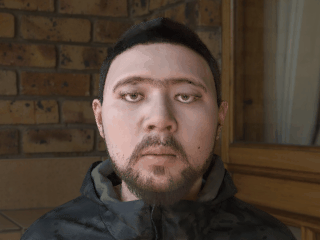
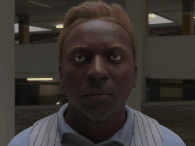
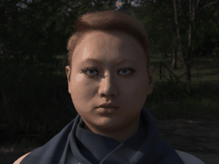
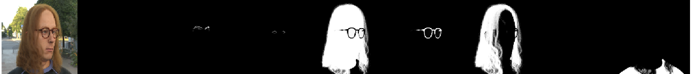
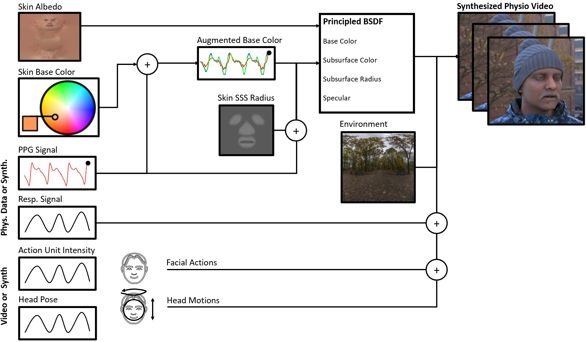
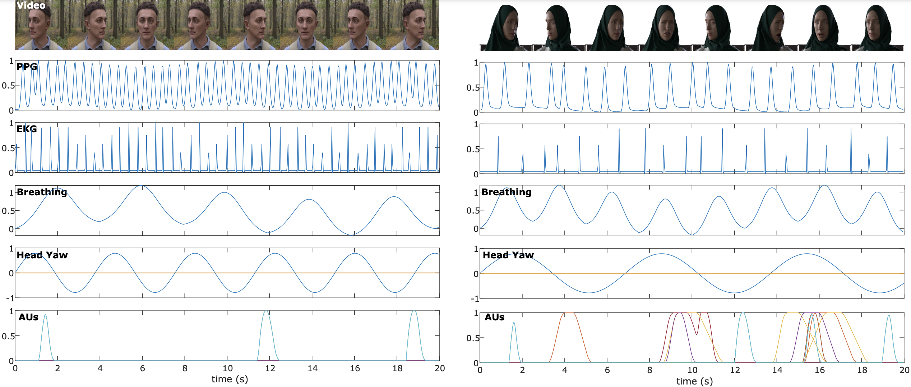

# Camera Measurement of Physiology

Camera physiological measurement is a rapidly growing field of computer vision and computational photography that leverages imaging devices, signal processing and machine learned models to perform non-contact recovery of vital physiological processes. Data plays an important role in both training and evaluating these models. However, generalization can be weak if the training data are not representative and systematic evaluation can be challenging if testing data do not contain the variations and diversity necessary.

# The SCAMPS Dataset

SCAMPS is a dataset of synthetics containing 2,800 videos (1.68M frames) with aligned cardiac and respiratory signals and facial action intensities. The RGB frames are provided alongside segmentation maps. 

It was introduced in our paper [**SCAMPS: Synthetics for Camera Measurement of Physiological Signals**](https://arxiv.org/abs/2206.04197).

Synthetics have proven valuable in several areas of computer vision, particularly face and body analyses.
However, creating high fidelity 3D assets for simulating many different facial appearances (e.g., bone structures, facial attributes, skin tones etc.) is time consuming and expensive. Therefore, in this paper we present a new dataset (\projectname) of high fidelity synthetic human simulations that will be made publicly available. These data are designed for the purposes of training and testing camera physiological measurement methods.

)
)
)
<!--

-->

## What the Dataset Contains:

Our dataset contains:
- 2,800 synthetic videos (1.68M frames)
- Aligned cardiac and respiratory waveforms for all frames
- Action unit labels for all frames
- Groundtruth heart rate, breathing rate, interbeat intervals and heat rate variability


Each RGB frame is accompanied by segmentation masks beard, eyelashes, eyebrows, glasses, hair, skin and clothing.




## How the Dataset was Created:

The synthetic videos were created using a graphics pipeline. A key part of our work is a realistic model of facial blood flow. We simulate blood flow by adjusting properties of the physically-based shading material we use for the face (https://www.blender.org/).  The albedo component of the material is a texture map transferred from a high-quality 3D face scan. The facial hair has been removed from these textures by an artist so that the skin properties can be easily manipulated (3D hair can be added later in the process). Specular effects are controlled with an artist-created roughness map, to make some parts of the face (e.g. the lips) shinier than others.

As blood flows through the skin, the composition of the skin changes and causes variations in subsurface color. We manipulate skin tone changes using the subsurface color parameters. The weights for this are derived from the absorption spectrum of hemoglobin and typical frequency bands from an exemplar digital camera (https://www.bnl.gov/atf/docs/scout-g_users_manual.pdf) (Red: 550-700 nm, Green: 400-650 nm, Blue: 350-550 nm).

Breathing causes several observable changes in the body. The most obvious usually being the motions of the chest and shoulders. Specifically, the pitch of the chest was rotated using the breathing input signal previously described. The rotation of the head was dampened slightly to create greater variance in the appearance changes and so that the breathing motions were largest in the chest and shoulders.




## How to Download the Dataset:

Small example of 10 video and labels (.mat format - 1.2GB) can be downloaded [here](https://hueaml.blob.core.windows.net/scampsdatasetrelease/scamps_videos_example.tar.gz)

The full set of videos and labels (.mat format - 600GB) can be downloaded [here](https://hueaml.blob.core.windows.net/scampsdatasetrelease/scamps_videos.tar.gz)

The full set of labels only (.mat format - 500MB) can be downloaded [here](https://hueaml.blob.core.windows.net/scampsdatasetrelease/scamps_waveforms.tar.gz)

The full set of labels only (.csv format - 60MB) can be downloaded [here](https://hueaml.blob.core.windows.net/scampsdatasetrelease/scamps_waveforms_csv.tar.gz)

A CSV file with official **Train**, **Validation** and **Test** splits [here](https://hueaml.blob.core.windows.net/scampsdatasetrelease/ScampsTrainTest)

## The Dataset Structure:
The dataset contains videos (RGB and segmentation frames), time aligned waveforms (e.g., PPG) and summary metrics (e.g., heart/pulse rate).


w = Image width, h = Image height, c = Channels, t = Time
```
scamps_videos.tar.gz
  PXXXXXX.mat
  ├── RawFrames         # Rendered images of the avatar at 320 x 240 resolution            [ c , w , h , t ]
  ├── Xsub              # Center cropped images containing the face at 240 x 240 pixels    [ c , w , h , t ]
  ├── skin_mask         # Segmentation mask of skin pixels at 240 x 240 pixels             [ w , h , t ]
  ├── combined_mask     # Segmentation mask of all avatar pixels at 240 x 240 pixels       [ w , h , t ]
  ├── numerical_mask    # Segmentation mask with numerical indicators of types             [ w , h , t ]
  ├── d_ppg             # PPG waveform signal                                              [ t ]
  ├── d_br              # Breathing waveform signal                                        [ t ]
  ├── d_pitch           # Head pitch signal                                                [ t ]
  ├── d_yaw             # Head yaw signal                                                  [ t ]
  ├── d_rol             # Head roll signal                                                 [ t ]
  ├── au2               # Action Unit 2 (AU2) intensity                                    [ t ]
  ├── au4               # Action Unit 4 (AU2) intensity                                    [ t ]
  ├── au7               # Action Unit 7 (AU2) intensity                                    [ t ]
  ├── au12              # Action Unit 12 (AU2) intensity                                   [ t ]
  ├── au15              # Action Unit 15 (AU2) intensity                                   [ t ]
  ├── au17              # Action Unit 17 (AU2) intensity                                   [ t ]
  ├── au18              # Action Unit 18 (AU2) intensity                                   [ t ]
  ├── au26              # Action Unit 26 (AU2) intensity                                   [ t ]
  ├── au27              # Action Unit 27 (AU2) intensity                                   [ t ]
  ├── au45              # Action Unit 45 (AU2) intensity                                   [ t ]
```

Reading the data example:

```
import h5py
f = h5py.File('P000001.mat', 'r')
print(f.keys())
```

## Transparency and Broader Impacts:

This dataset was created for research and experimentation on camera measurement of physiological signals. While the dataset is useful for testing models, is not designed as a test set for evaluating the clinical efficacy of a model, just because a model performs well on synthetic data does not mean it will generalize to videos of real people.

The SCAMPS dataset was not designed for computer vision tasks such as face recognition, gender recognition, facial attribute recognition, or emotion recognition. We do not believe this dataset would be suitable for these applications without further validation.

Advantages of camera physiological measurement are that contact with the body is not required and that cameras are ubiquitous sensors. However, these advantages can cause problems. Unobtrusive measurement from small, ubiquitous sensors makes measurement without a subject's knowledge simpler. 

## Disclaimer:

Some of our rendered faces may be close in appearance to the faces of real people.  Any such similarity is naturally unintentional, as it would be in a dataset of real images, where people may appear similar to others unknown to them.


## How does the Synthetics Generalize to Real Data:

It is natural to ask the question: "How well does a model trained on these synthetic data generalize to real videos?"  To provide a baseline we evaluated a neural model trained on the SCAMPS data on the [UBFC](https://sites.google.com/view/ybenezeth/ubfcrppg) and [PURE](https://www.tu-ilmenau.de/universitaet/fakultaeten/fakultaet-informatik-und-automatisierung/profil/institute-und-fachgebiete/institut-fuer-technische-informatik-und-ingenieurinformatik/fachgebiet-neuroinformatik-und-kognitive-robotik/data-sets-code/pulse-rate-detection-dataset-pure) datasets, more details can be found in our [paper](https://arxiv.org/abs/2206.04197), but the highlevel results showed good performance on both dataset:

**UBFC**

Mean Abs. Error (beat/min):         5.42     

Root Mean Sq. Error (beat/min):     13.1

Pearson Corr.:                      0.72


**PURE**

Mean Abs. Error (beat/min):         4.59

Root Mean Sq. Error (beat/min):     8.89

Pearson Corr.:                      0.81

## Code for Camera Physiology

https://github.com/danmcduff/iphys-toolbox

## Citation

If you use the SCAMPS Dataset your research, please cite the following [paper](https://arxiv.org/abs/2206.04197):


```
@article{mcduff2022scamps,
  title={SCAMPS: Synthetics for Camera Measurement of Physiological Signals},
  author={McDuff, Daniel and Wander, Miah and Liu, Xin and Hill, Brian L and Hernandez, Javier and Lester, Jonathan and Baltrusaitis, Tadas},
  journal={arXiv preprint arXiv:2206.04197},
  year={2022}
}
